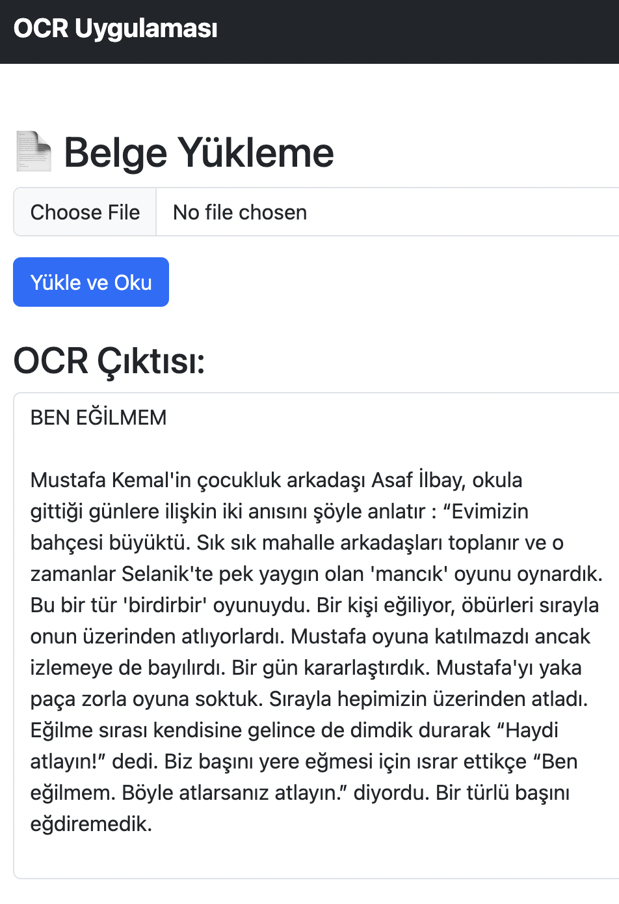

Tabii 👍 Senin projen için detaylı bir **README.md** hazırladım. İngilizce, profesyonel ve GitHub’a direkt koyabileceğin formatta:

---

```markdown
# Flask OCR App

A simple yet powerful OCR (Optical Character Recognition) web application built with **Flask** and **Tesseract OCR**.  
The app allows users to upload documents, IDs, and receipts, then extracts and displays text in a clean, readable format.  
It also supports Turkish OCR with preprocessing and post-processing for better accuracy.  

---

## 🚀 Features
- Upload and extract text from:
  - **Documents** (PDFs, scans, photos)
  - **IDs** (Turkish ID format supported)
  - **Receipts / invoices**
  - **Images** (JPG, PNG, TIFF, WEBP, etc.)
- Supports **Turkish language** via `tur.traineddata`
- Preprocessing for noise removal and better accuracy
- Post-processing to clean and format OCR results
- Simple web interface with responsive design

---

## 🛠️ Tech Stack
- **Backend:** Flask (Python)
- **OCR Engine:** Tesseract OCR
- **Frontend:** HTML, CSS (Bootstrap-like custom styling)
- **File Handling:** Pillow, PyPDF2 / pdf2image

---

## 📂 Project Structure
```

flask-ocr-app/
│
├── app.py                # Flask backend
├── templates/            # HTML templates
│   ├── index.html
│   ├── upload.html
│   ├── kimlik.html
│   ├── fis.html
│   └── pdfcevir.html
├── static/
│   └── style.css         # Custom CSS styling
└── README.md             # Project documentation

````

---

## ⚙️ Installation

1. Clone the repository:
   ```bash
   git clone https://github.com/your-username/flask-ocr-app.git
   cd flask-ocr-app
````

2. Create and activate a virtual environment:

   ```bash
   python3 -m venv venv
   source venv/bin/activate   # for Linux/Mac
   venv\Scripts\activate      # for Windows
   ```

3. Install dependencies:

   ```bash
   pip install -r requirements.txt
   ```

4. Install **Tesseract OCR**:

   * macOS (brew):

     ```bash
     brew install tesseract
     ```
   * Ubuntu/Debian:

     ```bash
     sudo apt install tesseract-ocr
     ```
   * Windows: [Download here](https://github.com/tesseract-ocr/tesseract)

5. Add Turkish language pack (if not already installed):

   ```bash
   brew install tesseract-lang  # macOS
   sudo apt install tesseract-ocr-tur  # Ubuntu/Debian
   ```

---

## ▶️ Usage

1. Run the Flask app:

   ```bash
   python app.py
   ```

2. Open in your browser:

   ```
   http://127.0.0.1:5000/
   ```

3. Choose one of the available options:

   * 📄 Document OCR
   * 🆔 ID OCR (with TC validation)
   * 🧾 Receipt OCR
   * 🖼️ Convert Image → PDF

---

## 📸 Screenshots



---

## 🤝 Contributing

Pull requests and feature requests are welcome!
If you find bugs or want to suggest improvements, please open an issue.

---

## 📜 License

This project is licensed under the MIT License.
